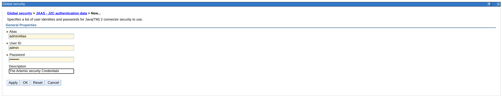
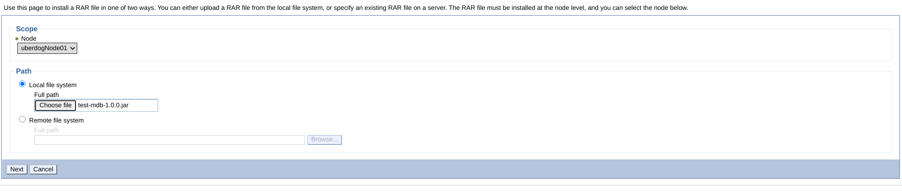
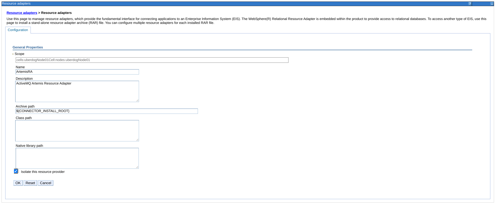
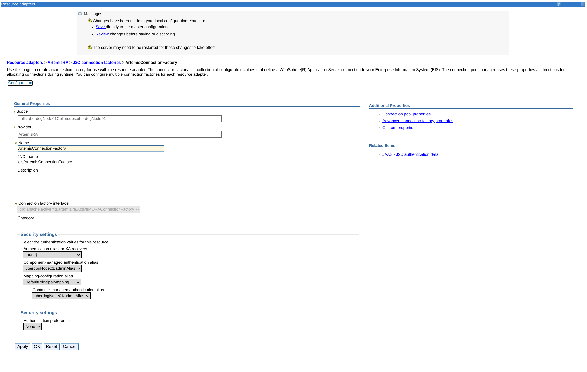
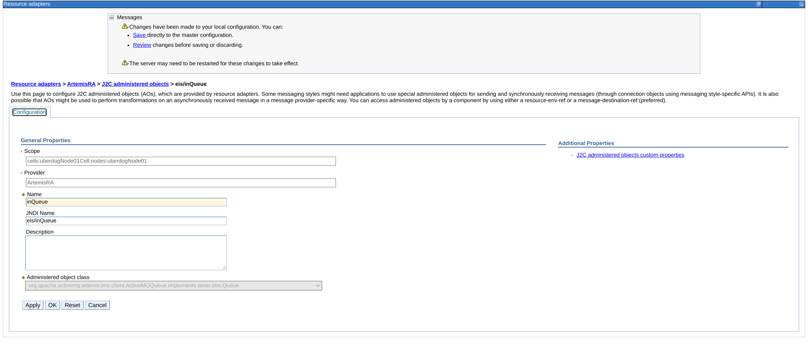
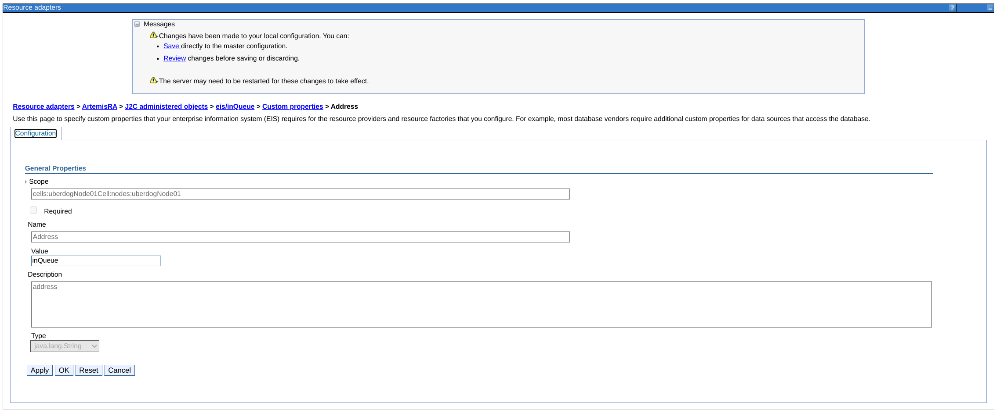
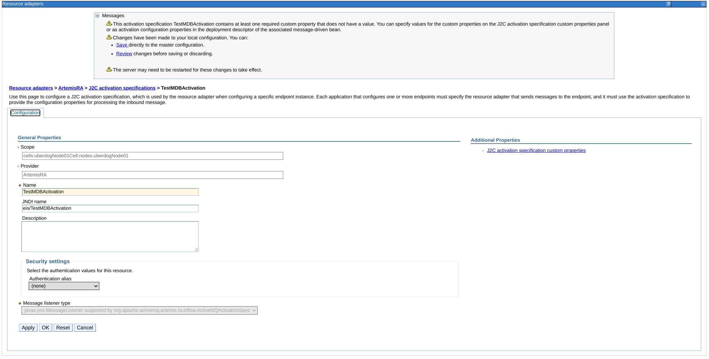

# artemis-websphere-integration
An example of configuring the Artemis Resource Adapter in WebSphere.

##Create the Broker

From the broker registry firstly set ARTEMIS_HOME to point at an Artemis distribution

```
export ARTEMIS_HOME=path-to-distribution
```

then create the broker instance

```
mvn verify
```

then start the broker

```yaml
 ./target/server0/bin/artemis run
```

##Build the MDB

##install RAR

before installing the RAR you ill need to create a user identity as an alias to configure the MDB Activation and J2C connector factory with.
The user and password should match a user in Artemis.  



navigate to Resource Adapters, click on Install RAR and enter the location of the Example Artemis Rar you created earler



Most of the information will be enetered alreay as it is taken from the ra.xml. It is important to check the `Isolate this resource adapter`
so it uses its own classloader, failure to do this causes classloader issues when the RA is deployed. 




Now navigate to ArtemisRA > J2C connection factories and click new to add a J2C Connection Factory which is the configuration for the Outgoing connection.


 
the important elements here ate the `JNDI Name` which will be the connection factory you will look up in the MDB and adding 
the user alias we created at the beginning of this chapter to the security settings. Click Apply.

This will now make `Connection pool properties` and `Advanced connection factory properties` clickable on the right, 
if needed you can update the defaults for the the connection factory and connection pool.

Now navigate to `J2C administered objects` where we will add 2 queues used by the MDB, inQueue and outQueue. firstly add 
an inQueue:



again the important element here is the `JNDI Name` which is used by the MDB and also the `Administered object class` should be of type Queue. 
Click apply then navigate to `J2C administered objects custom properties` on the right. 
We need to set the `Address` to be the actual address configured in the Broker. Click Apply.



Now do the same for the outQueue

Now lets add the MDB Activation by navigating to `J2C activation specifications`



configure the name and JNDI name of the Activation, this is used later when deploying the MDB. . Now navigate to `J2C activation specification custom properties` 
on the right and configure the `user` and `password` to the user configured in the broker and any other activation default you require. 

---
**NOTE**

we don't set the authentication alias on the incoming connection as this is set in the Activation itself

---

you can now save to the master configuration