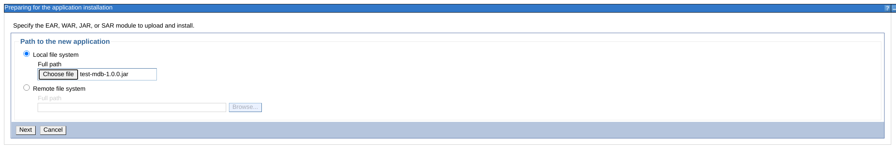

# Artemis Websphere-Integration
An example of configuring the Artemis Resource Adapter in WebSphere.

## Create the Broker

From the broker registry firstly set ARTEMIS_HOME to point at an Artemis distribution

```
export ARTEMIS_HOME=path-to-distribution
```

then create the broker instance

```
mvn verify
```

then start the broker

```yaml
 ./target/server0/bin/artemis run
```

## Build the MDB

navigate to the `tst-mdb` directory and run 

```
mvn clean package
```
## Build and deploy the Websphere Transaction Manager locator

---
**WARNING**

Currently because of an issue with loading the WebSphere location manager this feature is currently not possible. The issue 
is that when the classloader is isolated an error occurs when loading in the `WSTransactionManagerLocator` class that is 
part of the transaction-manager-locator project. The error message is `java.lang.ClassCastException: com.ibm.ws.tx.jta.TranManagerSet incompatible with javax.transaction.TransactionManager`

---

The Artemis resource Adapter allows the configuration of the Transaction Manager used by the Application Server. This is 
used for 2 things:

1. To check the status of a transaction in certain states to better handle certain events such as timeouts and avoifing sending when th etransaction is alreay aborted
2. For outgoing connections to decide whether or not to participate in a running JTA transaction when a session is created.

To build the WebSphere Transaction Manager locator go to the `transaction-manager-locator` directory and run:

```
mvn clean install
```

and then before building the resource Adapter in the next chapter add the following dependency to the pom.xml of the RAR example.

```xml
<dependency>
   <groupId>org.rhmessaging.artemis.ra.websphere.tx</groupId>
   <artifactId>transaction-manager-locator</artifactId>
   <version>1.0.0</version>
  </dependency>
```

      
## Build the Resource Adapter

Checkout the Source Code for Artemis, navigate to `examples/features/sub-modules/artemis-ra-rar` and run

```
mvn clean package
```


## Install RAR to WebSphere

Before installing the RAR you will need to create a user identity as an alias that will be used by the  MDB Activation and J2C connector factory.
The user and password should match a user in Artemis.  


Navigate to Resource Adapters, click on Install RAR and enter the location of the Example Artemis Rar you created earlier


Most of the information will be entered already as it is taken from the ra.xml. It is important to check the `Isolate this resource adapter`
so it uses its own classloader, failure to do this causes classloader issues when the RA is deployed. 


Now navigate to ArtemisRA > J2C connection factories and click new to add a J2C Connection Factory which is the configuration for the Outgoing connection.


 
The important element here is the `JNDI Name` which is the Connection Factory configured in the MDB:
 
```java
@Resource(mappedName="java:eis/ArtemisConnectionFactory")
private ConnectionFactory connectionFactory;
``` 
 
Also you wll need to configure the Security Settings to use the alias created earlier. 

Once you can now click `Apply` the `Connection pool properties` and `Advanced connection factory properties` on th right will be clickable, 
if needed you can update the defaults for the the connection factory and connection pool.

Now navigate to `J2C administered objects` where we will add the 2 queues used by the MDB, inQueue and outQueue. firstly add 
an inQueue:


Again the important element here is the `JNDI Name` which is used by the MDB and also the `Administered object class` should be of type Queue. 
Click apply then navigate to `J2C administered objects custom properties` on the right. 
We need to set the `Address` to be the actual address configured in the Broker. Click Apply.


Now do the same for the outQueue.

Now lets add the MDB Activation by navigating to `J2C activation specifications`


Configure the name and JNDI name of the Activation, this is used later when deploying the MDB. . Now navigate to `J2C activation specification custom properties` 
on the right and configure the `user` and `password` to the user configured in the broker and any other activation default you require. 

---
**NOTE**

we don't set the authentication alias on the incoming connection as this is set directly on the Activation itself.

---

you can now save to the master configuration

## Deploying the MDB

This chapter will cover the main configuration options for a default. WebSphere has many configuratopn options so please 
refer to the WebSphere manual for more information.

From the Applications left hand menu click `New Application` and choose the test mdb jar in the target directory.



For this examaple we will configure via the fast path as we are using mostly default configurations.


Also leave the installation options with the defaults.


Now check the boxes of the servers that you want to install the MDB too. Typicaly there will be only 1 in a local deployment


Now check the box of the MDB and select `Activation Specification` and enter the jndi name of the Activation you created earlier.
This will bind the queue configured in the MDB with the following code with the `outQueue` configured earler as an Administered Object.


Next we want to configure the Queue for the MDB by pointing it to the `JNDI` name of the Admistered Object we created earlier.


This maps to the queue defined on the MDB:

```java
@Resource(mappedName="java:eis/outQueue")
private Queue queue;
```
Now we map the Connection factory created earlier to the Connection Factory used by the MDB.


This gives a warning saying that the jndi resource cannot be found, this can safely be ignored and will reconcile correctly at runtime.


You can now skip through the remaining steps and create the deployment. Lastly you will need to start the MDB deployment 
from the `Applications` Menu. 


You can now log into the Artemis console and inspect the Consumers where you should see a pool of consumers on the in queue.

If you dont see these then refer to the WebSphere logs for issues.


## Testing the MDB

### Test using the Console

You can test the MDB by simply navigating to the inQueue in the Artemis console and clicking the `Send Message` tab and sending a message.

You can then check the inQueue and outQueue attributes to see the message count etc has changed

### Test using the test client

You can also use the Test client provided by navigating to the `test-client` directory and run the command:


```shell script
mvn clean test
```

This will send and receive 100 message to the MDB.

# Gotchas

**Error**

```shell script
WSCUrlFilter exception using CSRFResponseWrapper: com.ibm.websphere.servlet.error.ServletErrorReport: java.lang.NoSuchMethodError: org/apache/commons/beanutils/PropertyUtils.removeBidiChars&#40;Ljava/lang/String&#59;&#41;Ljava/lang/String&#59; &#40;
```
**Cause**

This happens when the Resource Adapter Classloader is not Isolated. When this is false the RA shares the Classloader with 
the Application Server, however the version of Apache Commons beanutils clashes with the version shipped with the RA ans  WebSphere
tries to call a method on the wrong version that does not exist.

---

**Error**

```shell script
com.ibm.ws.exception.RuntimeError: com.ibm.ws.exception.RuntimeWarning: javax.resource.ResourceException: Failed to lookup ActivationSpec.eis/TestMDBActivation
```

**Cause** 

This can happen when you create an MDB Deployment but the Resource Adapter didn't start correctly

**Fix**

Inspect the WebSphere logs to identify why the RA wasn't started.

---

**Error**

```shell script
SecurityException: No password credentials found
```

**Cause**

This can happen when creating an outbound connection if the authentication Alias was not created and bound correctly.

---

**Fix**

Create an authentication alias and configure the RA to use it

**Error**

Multiple logs of

```shell script
AMQ153005: Unable to retrieve "java:eis/inQueue" from JNDI. Creating a new "javax.jms.Queue" named "inQueue" to be used by the MDB.
```

**Cause**

This means that either the queue was not created on the broker or that the RA does not have permissions to auto create the queue.

**Fix**

Configure the Quue on the broker

---

**Error**

```shell script
org.apache.activemq.artemis.ra.inflow.ActiveMQActivation reconnect AMQ154003: Unable to reconnect org.apache.activemq.artemis.ra.inflow.ActiveMQActivationSpec(ra=org.apache.activemq.artemis.ra.ActiveMQResourceAdapter@151f1de1 destination=java:eis/inQueue destinationType=javax.jms.Queue ack=Auto-acknowledge durable=false clientID=null user=null maxSession=15)
ActiveMQNotConnectedException[errorType=NOT_CONNECTED message=AMQ219007: Cannot connect to server(s). Tried with all available servers.]
```

**Cause**

Either the connection info is incorrect, i.e. wrong URL, or the wrong user/password is being used.

**Fix**

Make sure the connection details match the brokers

---
 **Error**
 
 ```shell script
javax.jms.JMSException: AMQ159007: Invalid Session Mode SESSION_TRANSACTED, to enable Local Transacted Sessions you can set the allowLocalTransactions (allow-local-transactions) on the resource adapter
```

**Cause**

This happens when the MDB is using X transactions but the outgoing connection is configured not to, this typically happens 
when creating from inside an MDB.

**Fix**

Either set inJtaTransaction to true on the MDB if you want the outgoing connection or participate in the XA Transaction,
create a non transacted Connection via the API or configure a local transaction.
 
